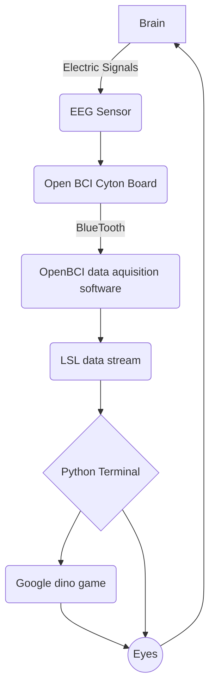

# Ultimate Invincible Super EEG Based Dino Controller Plus Max Ultra Pro

This project aims to create a system that allows users to play google dino game using EEG data. We’ll use Python to acquire real-time muscle EEG data via the Lab Streaming Layer (LSL) and then let the dino jump.

### Requirements

| name        | function |  website  |
| :--------  | :-----  | :----:  |
| Cyton board | data conversion|[openBCI](https://docs.openbci.com/GettingStarted/Boards/CytonGS/)|
| Python | data processing|[Python](https://www.python.org/downloads/)|
| Ear clip electrodes and wires | data collection|[openBCI](https://docs.openbci.com/GettingStarted/Boards/CytonGS/)|

#### Python lib
Python: `pip install pylsl`
Python: `pip install pyautogui`
Python: `pip install os`

### Algorithm implementation (flowchart)

````
# main python code :
valuelist = []
while len(valuelist) < value_length: # detect the value twice to make sure the correction
    chunk, timestamps = inlet.pull_chunk()
    if timestamps:
        valuelist.append(chunk[0][1]) # collecting the data
    
if sum(i >= threshold for i in valuelist) >= value_length / 2: # logic to jump
    if trigger:
        keyDown('space') # jump
        print("Jump ", count)
        count += 1
            trigger = not trigger
````




### Effect demonstration

not yet