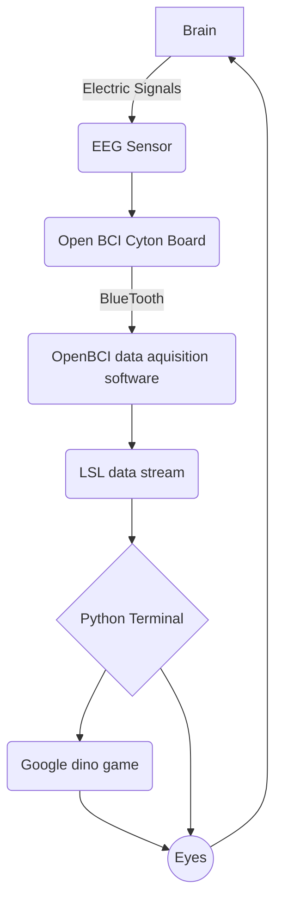

# Ultimate Invincible Super EEG Based Dino Controller Plus Max Ultra Pro


This project aims to create a system that allows users to play google dino game using EEG data. We’ll use Python to acquire real-time muscle EEG data via the Lab Streaming Layer (LSL) and then let the dino jump.

### Requirements

| name        | function |  website  |
| :--------  | :-----  | :----:  |
| Cyton board | data conversion|[openBCI](https://docs.openbci.com/GettingStarted/Boards/CytonGS/)|
| Python | data processing|[Python](https://www.python.org/downloads/)|
| Ear clip electrodes and wires | data collection|[openBCI](https://docs.openbci.com/GettingStarted/Boards/CytonGS/)|

#### Python lib

Python: `pip install pylsl`

Python: `pip install pyautogui`

Python: `pip install os`

### How to play

**1: **Link the cyton board to the ear clip electrode, then connect the Bluetooth receiver of the cyton board to the computer and open the openBCI application to connect to the cyton board

**2: **Connect the graphite electrode to the second serial port of the cyton board, and then open the `data transmission` of the `second serial port` in the openBCI application

**3: **Set up openBCI application to `LSL network transmission mode` and transmit `second serial port` data in this mode

**4: **Open Chrome browser and enter in the navigation bar `chrome://dino`

**5: **Place the graphite electrode on your forehead or temple, then open the chrome dino game

**6: **Grit your teeth or stomp your feet in every place you need to jump to make Dino jump in the right place

**7: **Becoming a Dino Master

### Algorithm implementation (flowchart)

```
# main python code :

valuelist = []
while len(valuelist) < value_length: # detect the value twice to make sure the correction
chunk, timestamps = inlet.pull_chunk()
if timestamps:
valuelist.append(chunk[0][1]) # collecting the data

if sum(i >= threshold for i in valuelist) >= value_length / 2: # logic to jump
if trigger:
keyDown('space') # jump
print("Jump ", count)
count += 1
trigger = not trigger
```



### Effect demonstration

OUO
